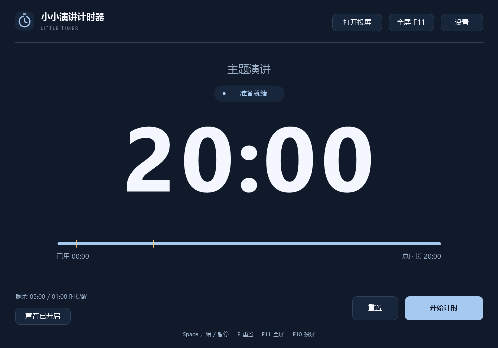
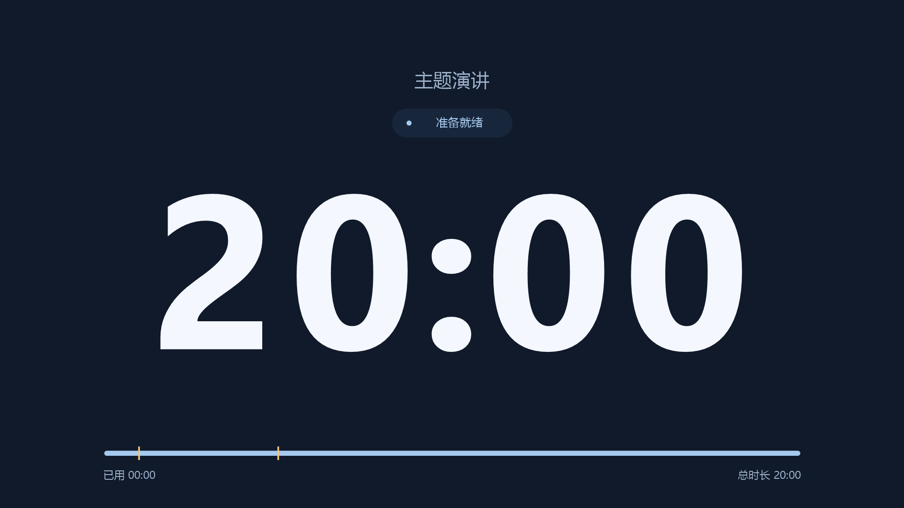
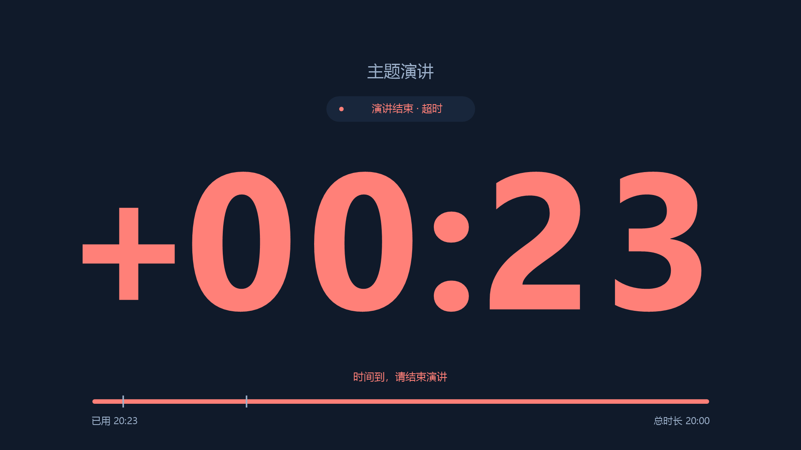

# 小小演讲计时器 · Little Timer

给会场大屏使用的 Windows 演讲计时器。超大时间数字、两种内置提示音、独立投屏窗口，单个 EXE 即可运行。



## 直接使用

打开 `dist/LittleTimer.exe`。不需要安装、管理员权限、网络、.NET、浏览器或额外的音效文件，可从 U 盘运行。

1. 点「设置」，填写演讲时长和提醒点，分别试听两种声音。
2. 点「开始计时」，或按 **Space** 开始 / 暂停。
3. 一台屏幕使用 **F11** 全屏；连接大屏时点「打开投屏」。

默认演讲 **20 分钟**，剩余 **5 分钟、1 分钟**时提醒，到时播放结束音，随后以红色显示超时时长。开始新一轮前点「重置」。

## 提醒设置

| 设置 | 用法 |
| --- | --- |
| 演讲时长 | 填 `20` 表示 20 分钟；`0:30` 表示 30 秒；也支持 `1:02:03`。最长 24 小时。 |
| 剩余时间提醒 | 填 `5, 1, 0:30`，分别在剩余 5 分钟、1 分钟、30 秒时提醒。最多 12 个点；留空关闭。 |
| 循环提醒间隔 | 填 `3` 表示每经过 3 分钟提醒一次；填 `0` 关闭。暂停时间不计入间隔。 |
| 时段提醒音 | 约 1.65 秒的柔和双音钟声，可单独开关、试听。 |
| 结束提醒音 | 约 2.35 秒的清晰三音钟声，比时段提醒更明显，可单独开关、试听。 |
| 音量 | 0–100，仅调整本程序的声音。总静音也可在控制窗口切换。 |
| 到时行为 | 勾选「到时后继续显示超时时长」时显示 `+00:01`；取消勾选则停在 `00:00`。 |

时段提醒点和循环间隔都必须小于总时长。时间点重合时只提醒一次；窗口卡顿后若已经超时，只播放结束提示，不补播先前的提醒。

时间状态同时使用文字与颜色：普通倒计时为白色，到达第一个剩余时间提醒点后为暖金色，到时为珊瑚红。到时声音每轮只播放一次。

## 会场大屏

「打开投屏」创建一个独立窗口。检测到另一块显示器时，会在该屏幕自动全屏；只有一块屏幕时，先打开普通投屏窗口，可将它拖到目标屏幕再双击全屏。Windows 显示模式设为「扩展」时，电脑上保留控制窗口，大屏只展示时间。





投屏窗口与控制窗口同步，关闭投屏窗口不会中断计时；最小化控制窗口也不会隐藏投屏。全屏时自动隐藏控制按钮，数字会随窗口大小调整，支持 16:9 和 4:3。超过一小时会显示 `时:分:秒`。

计时过程中程序请求屏幕常亮，并阻止自身窗口收到的屏保指令；暂停或退出后释放电源请求。手动休眠、关盖或系统强制锁屏仍由 Windows 决定。计时使用单调时钟，修改系统日期和时间不会改变剩余时长。

| 快捷键 | 操作 |
| --- | --- |
| **Space** | 开始 / 暂停 / 继续 |
| **R** | 重置本轮，有进度时先确认 |
| **F11** / 双击背景 | 当前窗口全屏 / 恢复 |
| **F10** | 打开 / 关闭投屏窗口 |
| **Esc** | 退出全屏；普通投屏窗口中再按一次可关闭投屏 |
| **M** | 总静音开关 |
| **Ctrl + ,** | 打开设置，需先暂停 |
| **Tab** / **Shift + Tab** | 切换控件焦点 |

快捷键在程序窗口获得焦点时生效。运行中不可更改计时设置；暂停后应用新设置会确认是否清空本轮进度。取消设置会保留当前计时。

## 便携设置

默认只运行一个 EXE，不写入配置或注册表。勾选「记住设置」后，在程序旁生成 UTF-8 编码的 `LittleTimer.ini`；下次启动自动读取。要随 U 盘保留设置，一起携带这两个文件即可。

取消「记住设置」并应用后，会移除已有的配置文件。文件夹不可写时，设置仍在本次运行中生效，控制窗口会提示保存失败。配置保存使用临时文件和替换操作，避免中途写入导致半份配置。

## 系统与兼容性

- 目标系统：**Windows 7 及以上，32 位 / 64 位**；发布产物为 32 位 x86 EXE。
- 原生 C++17、Win32、GDI+ 软件绘制，静态链接 C++ 运行库，无 GPU 或第三方 GUI 框架要求。
- PE 系统及 GUI 子系统版本为 **6.1**，启用 ASLR / DEP。
- 音效在内存中合成，通过 Windows WinMM 播放，无磁盘解压和外部 WAV 文件。
- 界面使用系统字体，缺失时回退到系统默认无衬线字体。采用 Windows 7 可用的系统 DPI 感知；不同缩放比例的显示器之间移动时，由 Windows 处理缩放。

**验证范围：** 已在 Windows 11 上运行 x86 程序及原生窗口测试，并核对 PE 导入和 Windows 7 接口边界；**尚未在 Windows 7 实机 / 虚拟机上运行验证**。完整记录见 [验证说明](docs/verification.md)。

主要接口的最低系统要求可见微软文档：[GetTickCount64](https://learn.microsoft.com/en-us/windows/win32/api/sysinfoapi/nf-sysinfoapi-gettickcount64)（Vista 起）、[GdiplusStartup](https://learn.microsoft.com/en-us/windows/win32/api/gdiplusinit/nf-gdiplusinit-gdiplusstartup)（Windows 2000 / XP 起）、[waveOutWrite](https://learn.microsoft.com/en-us/windows/win32/api/mmeapi/nf-mmeapi-waveoutwrite)（Windows 2000 起）。

## 从源码构建

推荐使用 **MinGW-w64 x86 / MSVCRT** 工具链。编译机器可以是较新的系统；使用程序的电脑不需要编译工具。

Linux 上准备 `i686-w64-mingw32-g++` 和 `i686-w64-mingw32-windres` 后运行：

```bash
bash scripts/build-mingw.sh
python3 scripts/verify-pe.py dist/LittleTimer.exe --report build/pe-report.json
```

Windows 上将同名工具加入 `PATH` 后运行：

```bat
scripts\build-windows.cmd
```

产物均为 `dist/LittleTimer.exe`。脚本采用静态链接，音效代码、图标和系统兼容性清单均已内置。仓库附带图标文件，无需 Pillow；只有重新生成图标时才需要运行 `scripts/generate_icon.py`。

另提供 `CMakeLists.txt`，用于本地核心测试及 Windows 构建。交付 EXE 使用上述 MinGW 脚本构建；改变编译器后应重新检查 DLL 依赖和最低系统要求。

## 开发验证

```bash
# 在 Linux 上运行计时、输入校验、配置、音频测试，含内存与未定义行为检查
bash scripts/test.sh

# 同时构建仅供验证的 Windows 程序
bash scripts/build-mingw.sh --qa
```

在 Windows PowerShell 中运行：

```powershell
.\scripts\verify-windows.ps1 `
  -Executable "$pwd\build\LittleTimerQA.exe" `
  -OutputDirectory "$pwd\build\windows-qa" `
  -CoreTests "$pwd\build\timer_tests.exe"
```

原生验证程序在屏幕外创建本程序的窗口，测试按钮、设置、投屏、全屏、音频和资源释放，并导出本程序界面截图。音频设备测试提交静音 PCM；`gentle.wav` / `end.wav` 仅作为试听样本导出。`LittleTimerQA.exe` 不属于发布产物。

GitHub Actions 工作流包含交叉编译、核心测试、PE 检查和 Windows 原生窗口检查；仓库推送后可从 Actions 获取构建产物。

## 许可证

沿用仓库的 [GNU GPL v2](LICENSE)。
